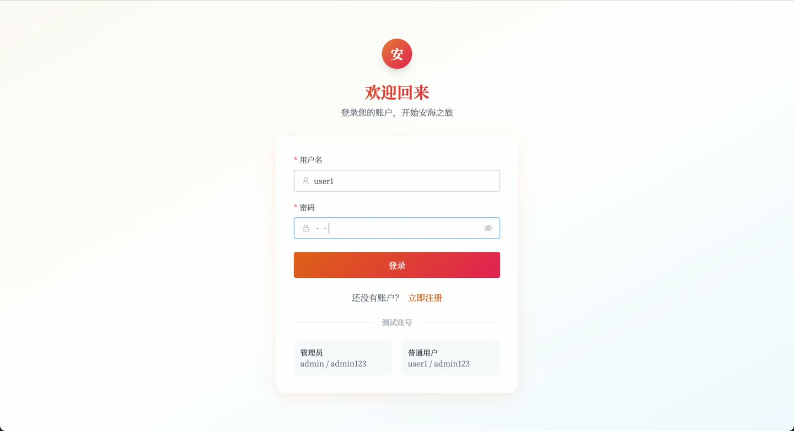
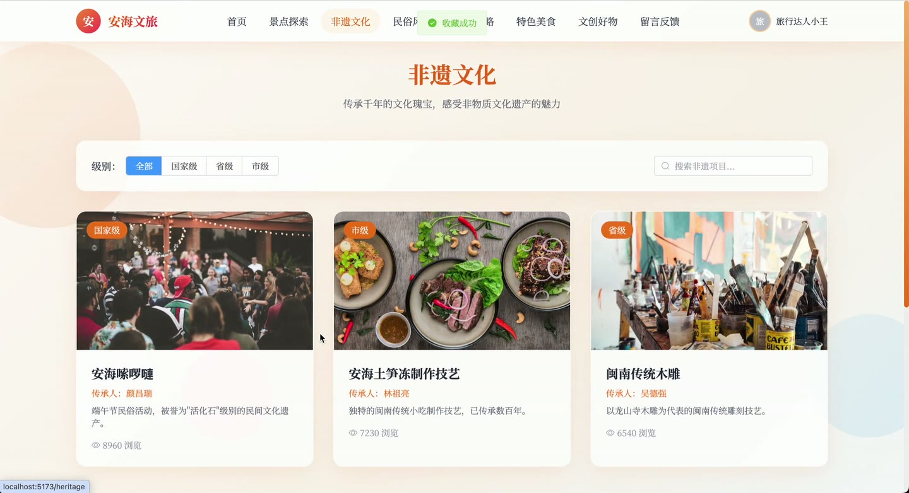
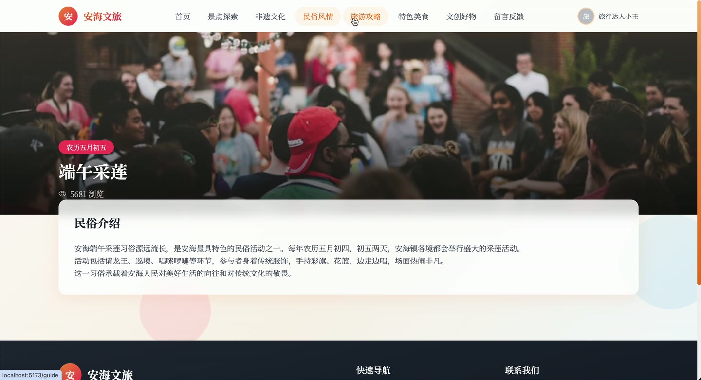
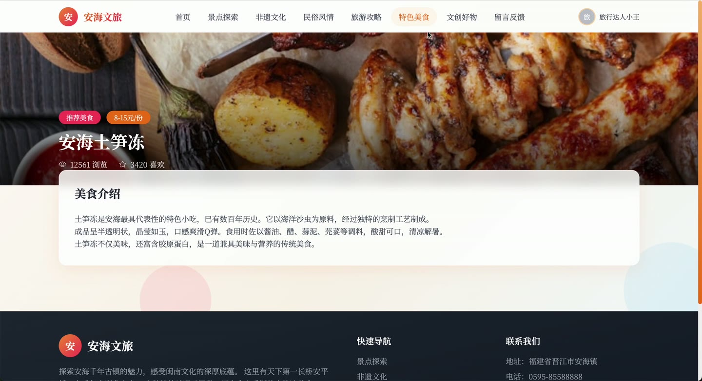
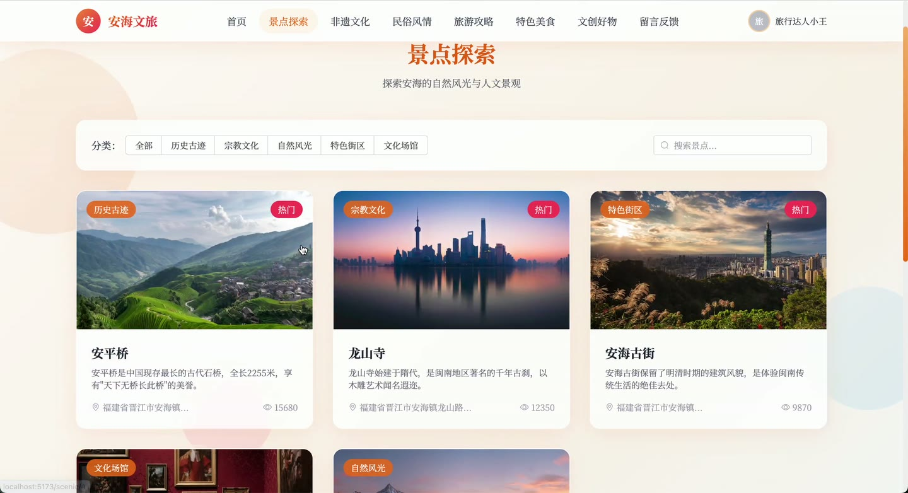
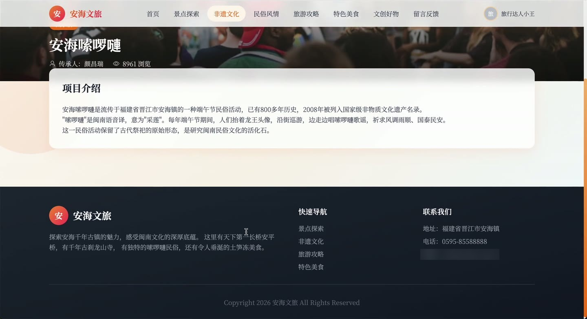

# (附文档)Python+Django+Vue3 安海文旅

**技术栈**：Python、Django、机器学习、Vue3、MySQL

### 系统简介

安海文旅平台是一套前后端分离的文旅综合服务系统，后端基于 Django REST Framework 提供接口，前端采用 Vue3 构建，覆盖景点、非遗、民俗、美食、攻略、商家、文创产品等文旅内容，并集成 AI 智能问答与个性化推荐能力。系统包含普通用户端与管理员端两类角色。
 
### 核心功能
 
### 普通用户端

 
- 注册与登录：提交用户名、密码完成注册，登录后返回 JWT Token 与用户信息。 
- 首页浏览：一次拉取轮播图、热门景点、推荐美食、最新攻略、非遗项目、民俗文化、推荐文创产品等聚合数据。 
- 景点浏览：按关键词或分类筛选景点列表，查看详情时自动累加浏览量，并支持查看热门景点。 
- 非遗与民俗浏览：分页查看非遗项目、民俗文化列表，进入详情自动累加浏览量。 
- 美食浏览：按关键词搜索美食，列表按推荐与浏览量排序，详情自动累加浏览量。 
- 攻略发布：登录后填写标题与内容发布游记攻略，提交后进入审核流程。 
- 攻略互动：对攻略进行点赞与取消点赞、收藏与取消收藏，实时更新点赞数与收藏数。 
- 个人中心：查看我发布的攻略列表、我收藏的攻略列表，并修改个人资料。 
- 商家与文创浏览：按关键词、商家类型筛选商家列表，查看商家详情；浏览文创产品列表与详情。 
- 评价与反馈：对目标对象提交评价内容，或提交留言反馈，并查看自己的反馈记录。 
- AI 智能助手：发起 AI 对话、查看历史对话记录与历史会话列表。 
- 个性化推荐：获取推荐内容列表，并根据当前条目获取相似内容推荐。 
- 行为上报：前端上报用户浏览等行为数据，用于推荐系统计算。
 
### 管理员端

 
- 仪表盘统计：查看后台核心数据统计概览。 
- 用户管理：查看用户列表、新增用户、启用或禁用用户状态、删除用户。 
- 景点分类管理：查看分类列表、新增分类、删除分类。 
- 景点管理：查看景点列表、新增景点、删除景点。 
- 非遗项目管理：查看非遗列表、新增非遗项目、删除非遗项目。 
- 民俗文化管理：查看民俗文化列表、新增民俗文化、删除民俗文化。 
- 美食管理：查看美食列表、新增美食、删除美食。 
- 攻略管理：查看攻略列表、查看攻略详情、审核攻略（通过或不通过）。 
- 商家管理：查看商家列表、新增商家、删除商家。 
- 文创产品管理：查看产品列表、新增产品、删除产品。 
- 轮播图管理：查看轮播图列表、新增轮播图、删除轮播图。 
- 反馈管理：查看反馈列表、回复反馈内容、删除反馈。 
- 文件上传：统一上传图片等媒体文件并返回访问地址。
 
### 技术栈

 后端框架Python + Django + Django REST Framework 认证与权限JWT（rest_framework_simplejwt）、IsAuthenticated / AllowAny 权限控制 数据访问Django ORM（F 表达式、Q 对象查询、分页） 前端框架Vue3 数据库MySQL 智能能力机器学习推荐（推荐列表、相似内容推荐、用户行为上报）、AI 对话助手 接口风格RESTful API，统一 code/message/data 响应格式
 
### 交付内容

 
- 后端完整源码 
- 前端完整源码 
- 数据库初始化脚本 
- 万字文档

## 界面展示

---

## 获取完整源码 + 万字文档

本仓库为项目介绍页。**完整前后端源码、数据库初始化脚本、万字项目文档**，请加微信 `kangkangcode`，或访问 [codekk.top](http://codekk.top) 获取。

可作课程设计 / 毕业设计参考，支持远程部署调试。